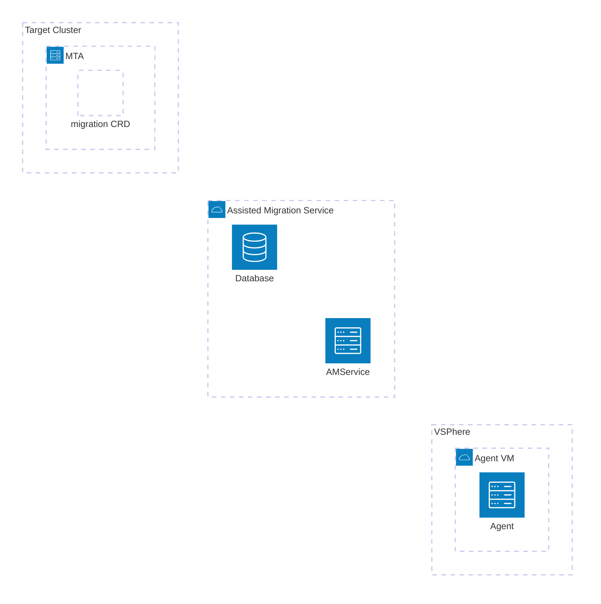

# migration-cluster-preprep

- custom manifest
A manifest that will be applied as part of the assisted installer setup
this manifest will install the helm chart that adds the prerequeisites and configurations for MTV operator for vSphere 

- A helm chart to be used with ArgoCD to install the following assets:
  - [ ] local storage
    - [ ] make sure storage class for kubevirt is annotated
  - [x] mtv-init service
        A service to help build vddk and mtv provider details using a simple web page
    - [x] vSphere credentials and url 
    - [x] vddk buildconfig
    - [x] vddk image

  - [x] mtv operator
      - [x] configure mtv host
      - [x] configure provider (depends on vsphere credentials)
 
  - [ ] network
    - [x] install nmstate operator
    - [ ] controller to create NAD according to MTV plan  

# Architecture

